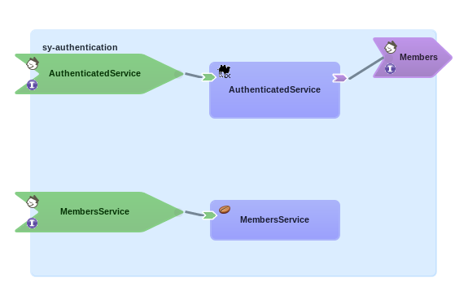

# SwitchYard Security Example

This example implements a Restful Web Service protected via http basic authentication. The username provided during authentication is added into the "username" header using a custom context mapper. Camel calls one of two rest services (also implemented in this project) based on the username.  It calls members/v1 if the username is "fswAdmin", otherwise it calls members/v2.

Note this was tested in Red Hat JBoss Fuse Service Works v6.0.  Authentication of Restful web services requires that FSW be patched (with the latest cumulative patch) in order to work properly.

The following curl command can be used to test the service:

    curl --user fswAdmin:password -X POST http://localhost:8080/service -d "Hello World"
    
This will end up calling members/v1.  Change the username/password to call members/v2.

Also note that authorization is tested as well so both users must belong to the "manager" role in EAP.
